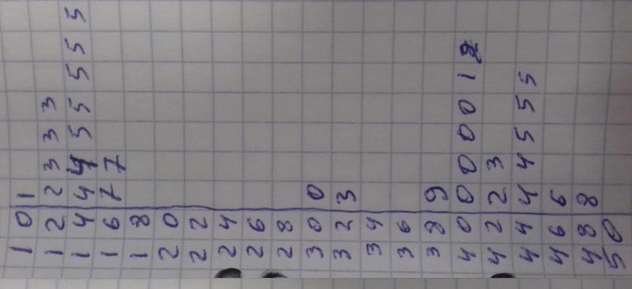
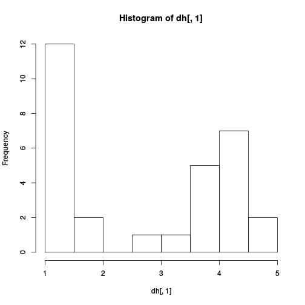
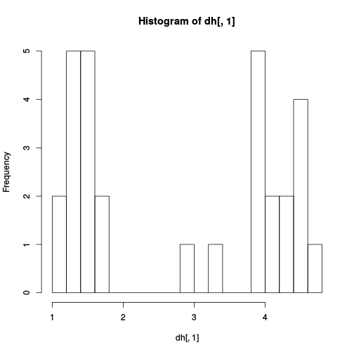
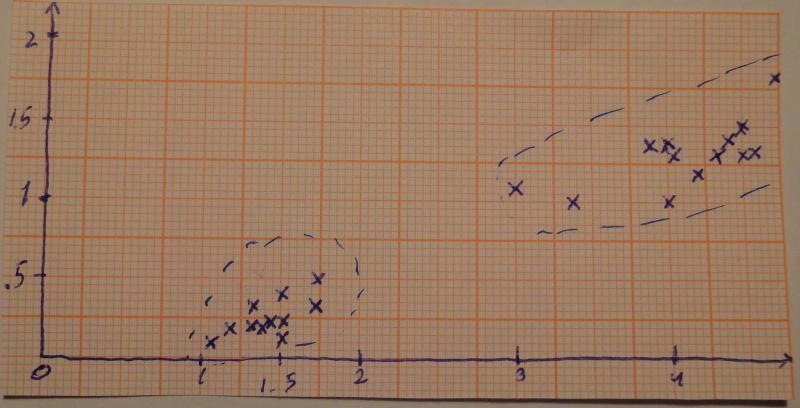
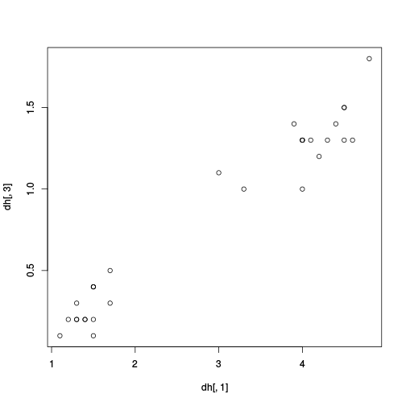

#Загружаем данные


```r
setwd("~/Документы/R/h")
dh <- read.csv(file = "data.csv", header = FALSE, sep = ",")
str(dh)
```

```
## 'data.frame':	30 obs. of  3 variables:
##  $ V1: num  4 1.4 4.2 4.3 4.5 4 4 4.5 1.5 1.5 ...
##  $ V2: int  2 1 2 2 2 2 2 2 1 1 ...
##  $ V3: num  1.3 0.2 1.2 1.3 1.3 1.3 1 1.5 0.4 0.4 ...
```
Первый столбец - первый признак, второй столбец - известные нам классы, третий - второй признак.

#Одномерная кластеризация. 

Диаграмма стебель-листья по первому признаку построенная вручную.

 
 
 

```r
hist(dh[,1])
```

 

Увеличив шаг


```r
hist(dh[,1],breaks = 15)
```

 

#Двумерная по двум признакам

Вручную



\clearpage


```r
plot(dh[,1],dh[,3])
```

 


